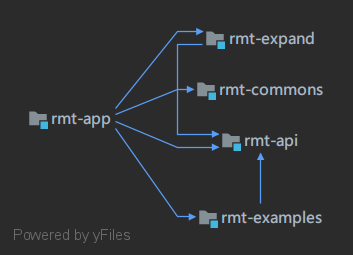
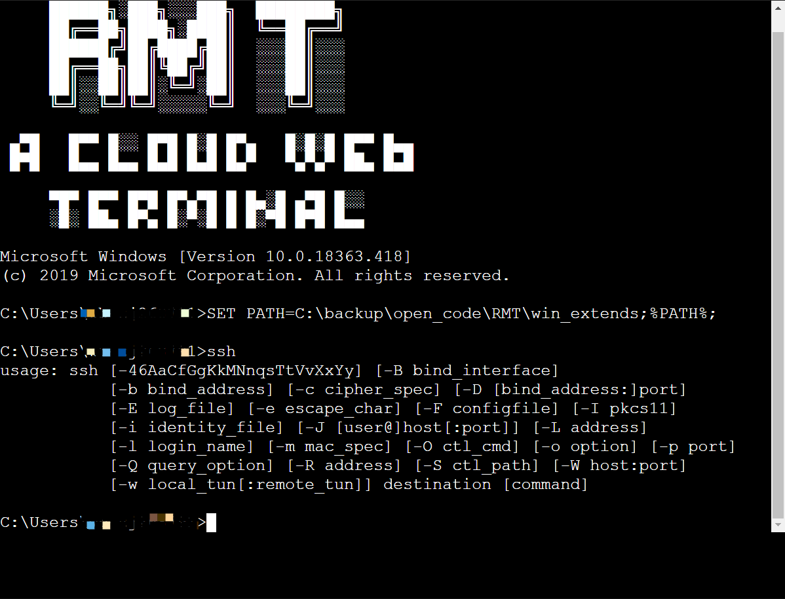
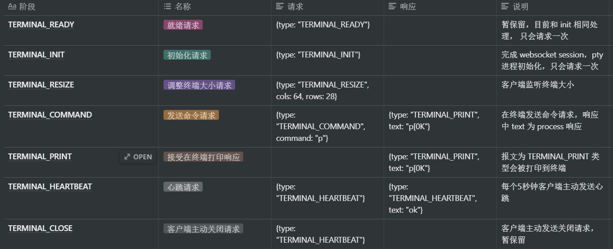

# RMT 开发文档

Created: Jun 24, 2020 4:27 PM

## 特性

1. Pty4J 作为底层终端交互, 作为 IDEA 终端交互的重要组件，稳定性可见一斑。 其底层使用 JNI ，流传输更加高效。
2. 设计简单，高效。分层清晰明了，更加适合二次开发，维护。
3. 易于拓展。基础功能 API 抽象，提供生命周期抽象， 监听器， Session 和进程绑定管理，方面后期维护拓展。
4. 借鉴 cloudterm 自定义报文做法， 在原有报文上做抽象，更加方便拓展， 修复原项目遗留问题点 ，例如 web 应用中 Pty4J 的阻塞，session 关闭后 pty 进程释放， 前端支持 wss ，修复窗口 resize 失效问题。

## 多模块说明



- 多模块依赖关系

1. rmt-api， 核心基础 API 模块抽象，包含生命周期，监听器，会话管理，进程管理。
2. rmt-expand， 实现核心 API 模块。
3. rmt-commons ， 应用公共方法封装。
4. rmt-app ,  Spring boot  主应用 ， 提供视图 ，websocket 端口，整个流程处理过程。
5. rmt-examples ， 提供常见拓展功能 API 演示。

## 拓展点

### 1.  TerminalProcessListener  终端流程监听器

 监听整个终端从建立连接，prepared 准备阶段 → beforeInit 初始化之前 → afterInit 初始化之后 → beforeCommand 发送命令之前（保留方法，暂未实现）→ requestToPty 向进程发送原始流之前 → responseFromPty  进程返回原始报文之后 → afterCommand 发送命令之后（保留方法，暂未实现）→ closed session关闭 → ifeCycleContext 乃至整个生命周期上下文监听，

- 示例： 启动时候加载  SSH 命令模块，实现 Windows 环境下可以使用 SSH命令。
    1. 实现  TerminalProcessListener 接口，重新 afterInit 方法。

        ```java
        public class WindowsExpandCommandLoaderListener implements TerminalProcessListener {

            @Override
            public String listenerName() {
                return this.getClass().getSimpleName();
            }

            @Override
            public void afterInit(TerminalMessage message, WebSocketSession socketSession,
                                  PtyProcess ptyProcess, BufferedWriter stdout, BufferedReader stdin,
                                  BufferedReader stderr) {

                if (Platform.isWindows()) {
        						// 获取存在 SSH 模块目录，加载到 Windows 暂时环境变量中
                    File file = new File("win_extends");
                    try {
        								//与 process 交互
                        stdout.write(MessageFormat.format("SET PATH={0};%PATH%;\r", file.getAbsolutePath()));
                        stdout.flush();
                    } catch (IOException exception) {
                        exception.printStackTrace();
                    }
                }
            }
        }
        ```

    2. 此时在启动后直接可以使用 SSH。

    

### 2.  TerminalSessionManager  连接 Session 管理

 可以对已经连接的客户端 Session 主动管理， 主动推送消息给终端。

- 示例：Session 操作
1. 注入 TerminalSessionManager  , 使用默认 DefaultTerminalSessionManager 实现。

    ```java
    // sessionManager
        @Bean
        public TerminalSessionManager terminalContextManager() {
            return new DefaultTerminalSessionManager();
        }
    ```

2. 使用 TerminalSessionManager

```java
@Autowired
private TerminalSessionManager terminalContextManager;
// 获取全部连接的 Session
Map<String, TerminalContext> sessions = terminalContextManager.sessionMap()
// 点对点发送消息给客户端
TextMessage textMessage = new TextMessage(
                    new ObjectMapper().writeValueAsString(new HashMap<String, Object>() {{
                        put("text", "\u001B[?25l\n Hello World");
                        put("type", TERMINAL_PRINT);
                    }}));
terminalContextManager.p2pSend(terminalContext, new TerminalMessage() {
                @Override
                public <T> WebSocketMessage<T> webSocketMessage() {
                    return (WebSocketMessage<T>) textMessage;
                }
            });

// 对全部客户端进行广播
Map<String, TerminalContext> sessionMap = terminalContextManager.sessionMap();
try {
            TextMessage textMessage = new TextMessage(
                    new ObjectMapper().writeValueAsString(new HashMap<String, Object>() {{
                        put("text", text);
                        put("type", TERMINAL_PRINT);
                    }}));
            terminalContextManager.broadCastSend(sessionMap, textMessage);
        } catch (IOException e) {
            return "send failed," + e.getMessage();
 }
return "ok";

```

 

## 交互报文

1 . 此操作在 WebSocket 连接建立之后， 状态为 Open 情况下，处理的自定义协议报文.


