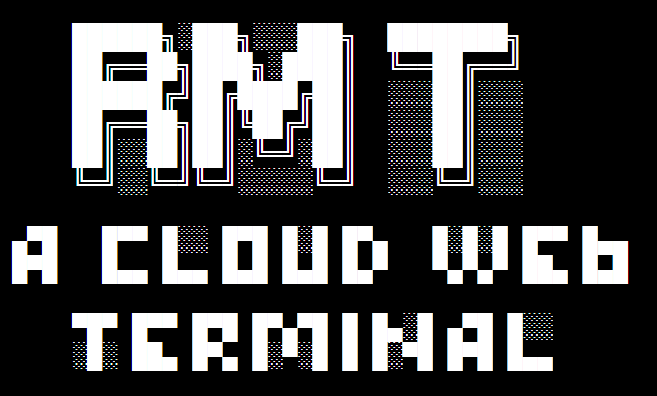

# RMT , A Cloud Web Terminal

[中文简体](cn.md)

[](https://travis-ci.org/Xarrow/RMT)
[](https://openjdk.java.net/install/)

<a href="https://ssh.cloud.google.com/cloudshell/editor?cloudshell_git_repo=https://github.com/Xarrow/RMT.git"></a>

A cloud web terminal based on Spring Boot , Pty4J and WebSocket.



Visit heroku example site: [https://rmt-ns.herokuapp.com/](https://rmt-ns.herokuapp.com/)

## Quick Start

you can download standalone jar from [release](https://github.com/Xarrow/RMT/releases/).

* for docker running

  ```
    docker pull helixcs/rmt:latest
  
    docker run -itd --name rmt-app -e PORT=8081 -p 8080:8081 helixcs/rmt:latest
 
  ```
  
* for jar running, required jre 1.8+

    ```java
  
      java -Dfile.encoding=UTF-8 -Dserver.port=8080 -jar rmt-app.jar 
  
    ```

## For Developer

1. checkout from github

    `git@github.com:Xarrow/RMT.git`

2. maven install 
    
    `mvn install -Dmaven.test.skip=true`
    
3. run with jar
    
    `java -Dfile.encoding=UTF-8 -Dserver.port=8080 -jar rmt-app\target\rmt-app.jar`
    
## Just Expand

Reference at：[RMT Docs](dev.md)


## Finally

* Started from [cloudterm](https://github.com/javaterminal/cloudterm) ,stronger with RMT.

## LICENSE

Apache2

This Project Powered By Jetbrains OpenSource License

